# MeditationMinds
# Daniel Maher's Porfolio 1 Website

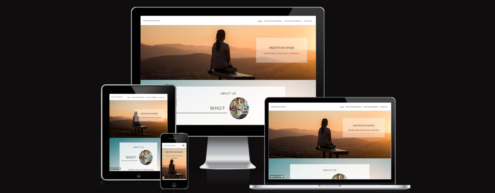

Website designed to provide end users with information on Meditation

## **Site Overview**
Meditation minds in a website designed to provide information to end users to help them in bringing meditation into their life.It is designed to be intuitive, and to evoke a sense of calmness in the end user.
<!-- screenshot of Homepage responsiveness to go here-->
## Table of contents:
1. [**Site Overview**](#site-overview)

# Readme:
## 1. Purpose of the project
This project aims to create a front-end site to present useful information to users regarding out meditation community. This has been done using the web design I have learned within Code Institute to date. 

This site aims to provide information regarding our community, including some self-guided meditation resources & information regarding our communal meditations.

Homepage: https://danielmaherdev.github.io/MeditationMinds/

## 2. User goals

The goal of both new and returning users is to find information and resources regarding meditation. 

Resources are provided on this site to fulfill this need, and a contact us page has also been provided if any questions are left unanswered.

### Navigation Bar
The navigation bar, like the rest of this site, was designed mobile-first. 
It appears at the top of all pages within this site, and as a burger menu on mobile devices.
This section will allow the visiting user to easily navigate from page to page across all devices without reverting to the previous page via the 'back' button.
The navigation has been implemented with a hover effect on desktop when hovering over a link.

#### Desktop
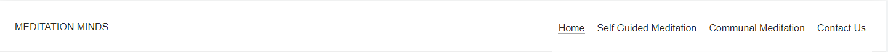

#### Mobile
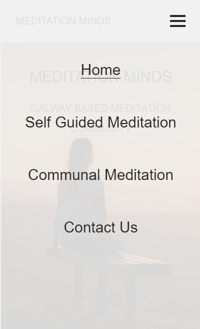

### The hero image
The homepage (index.html) contains a large hero image at the top of the page, along with the title of the website and a short description.
The text overlay on desktop has a white semi-opaque background on desktop to allow for sufficient contrast and moves on smaller screen sizes for compatibility.

#### Desktop
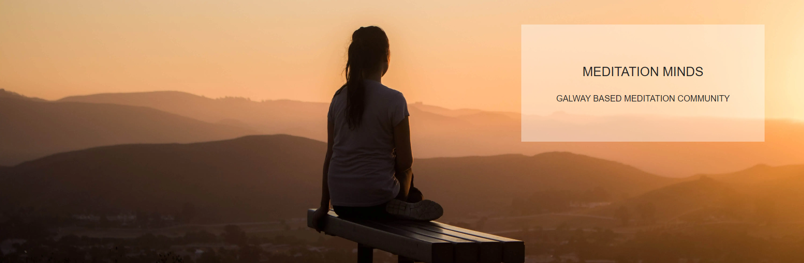

#### Mobile
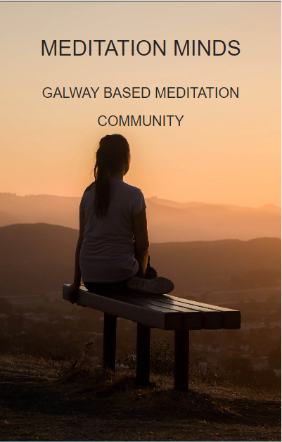

### About Us Section
Further down from the hero image we have the about us section. This is to provide the user with basic information about the community.

#### Desktop
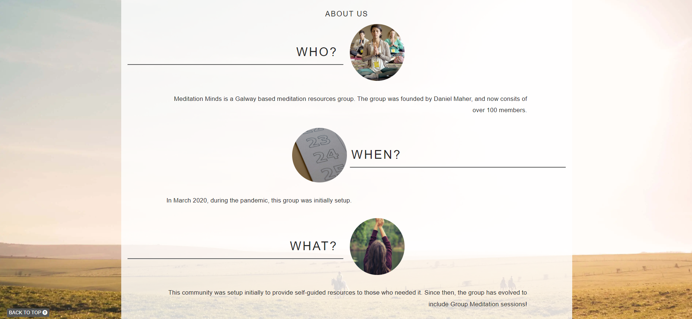

#### Mobile
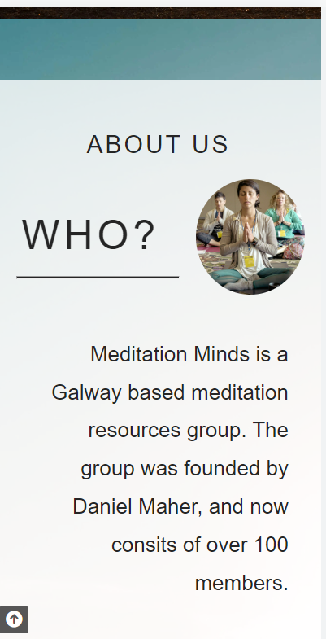

### Self Guided Section
Below the about us section, you will find the self-guided section. This section provides 3 blocks of information regarding our self guided meditations. Each section contains a button which redirects to a specific anchor link on the self-guided meditation page.
Each block also includes a hover effect on desktop screens, which should produce an animation revelant to the exercise mentioned. These animations were made purely with HTML & CSS.

#### Desktop
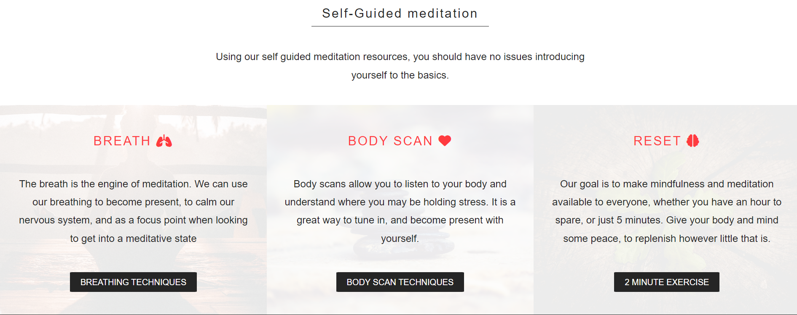

#### Mobile
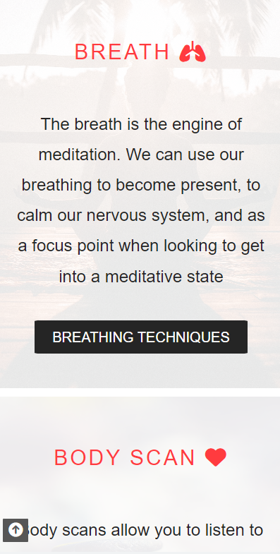

### Communal Meditation Section

Below the self-guided meditation section is a section regarding our communal meditation. This is also referenced in the navigation bar.

This section provides information on our group meditations, occuring twice monthly. Similar to the Self-Guided section, this section is set to show each block side by side on desktop and on top of one another on mobile.
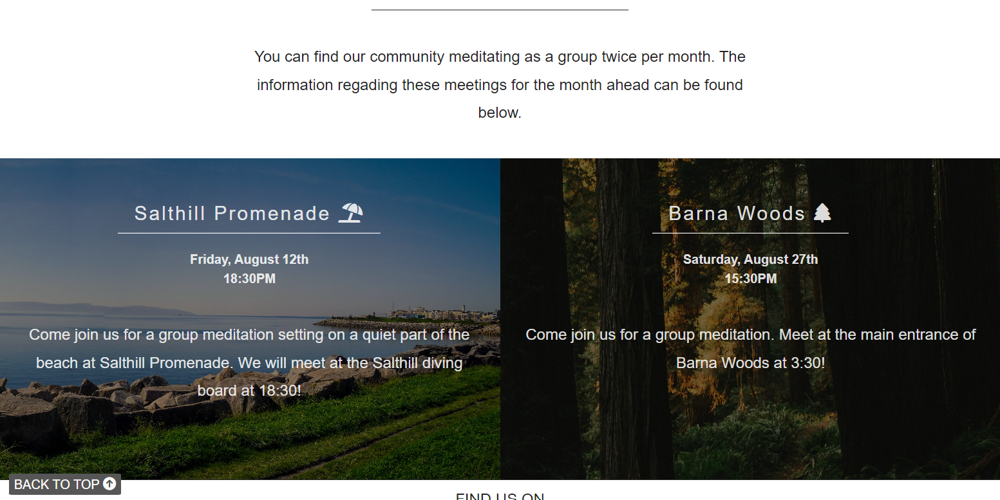

### The Footer
The footer section includes links to the relevant social media sites for our meditation group. As there is no actual social media accounts setup, these links will simply navigate to the homepage of the social media site in question.
These links will open in a new tab.
The footer appears on all pages of the website.

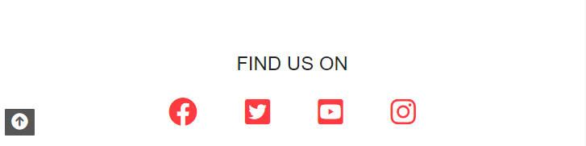

### Self Guided Page

This page provides information on the 3 different self-guided blocks on the homepage. This page is also referenced in the navigation on each page.
The top of this page features a sub navigation below the title, linking to each of the sections on this page, breath, body scan, and reset.
The content witin each of the 3 sections is styled using grid within the css stylesheet.

Similar tp previous sections, this grid layout will collapse on smaller screen sizes.

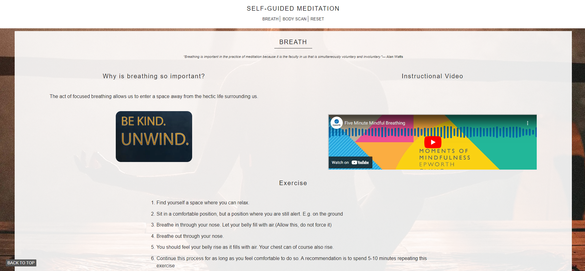

### Contact Us Page
The contact us page contains the familiar basic header and footer structure, along with a form. 
This form collects the full name and email address of the user submitting the form. Along with this, it collects the users query.
The form will then redirect the user to a thank you page, with navigation links to the other sections of our site.

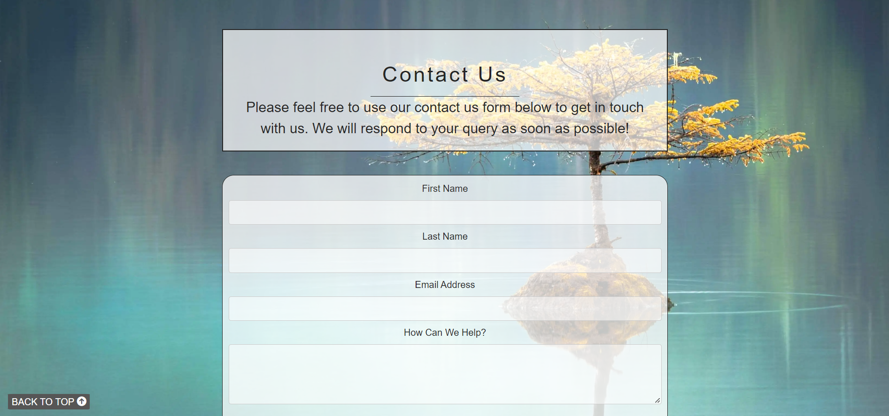

## 3. Future Changes & Features
* I plan to include a LinkedIn option within my social links on the footer of this pahe
* Future releases will see improvement of the layout within the self-guided page. This site was designed mobile first, but this page could be restructured to make it more compatible with larger screens
* Currently the form redirects to a thank you page but does not send the form imformation anywhere. This is something I am looking to introduce in a future release.

## 4. Typography and colour scheme
The Typography used on the site was Oxygen Light 300 and was taken from [Google Fonts](https://fonts.google.com/specimen/Oxygen).
I wanted the site to feel light, and spacious, and I feel this font allowed for this.

The scheme of the colours used for the site is this:
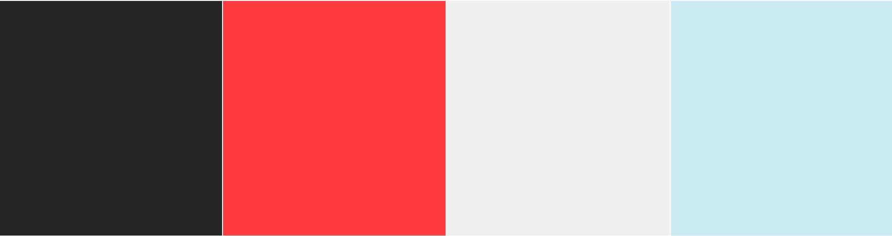

## 5. Technology
After studying the HTML and CSS essentials course with Code Institute, this project was created in Git pod using HTML and CSS languages.
I have not imported any libraries , or used bootstrap for this site.
There is also minimal JS used for the mobile navigation menu.

## 6. Testing
**Code validation**
**_HTML_**
No errors were returned when passing through the official W3C validator on any pages
[Homepage](https://validator.w3.org/nu/?doc=https%3A%2F%2Fdanielmaherdev.github.io%2FMeditationMinds%2F)

[Self-guided page](https://validator.w3.org/nu/?doc=https%3A%2F%2Fdanielmaherdev.github.io%2FMeditationMinds%2Fselfguided.html)

[Contact Us page](https://validator.w3.org/nu/?doc=https%3A%2F%2Fdanielmaherdev.github.io%2FMeditationMinds%2Fcontact-us.html)

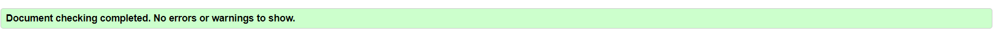

**_CSS_**
No errors were found when passing through the official [(Jigsaw) validator](https://jigsaw.w3.org/css-validator/validator?uri=https%3A%2F%2Fdanielmaherdev.github.io%2FMeditationMinds%2Fcontact-us.html&profile=css3svg&usermedium=all&warning=1&vextwarning=&lang=en)

## 8. Fixed Bugs
I experienced a bug when creating the animation effect for the 'reset div on the homepage'. This animation gave the affect that the heading within this div scrolled out the right hand side of the div, and then scrolled back in the left side of the div.

Bug: The text scrolled on top of other elements in the page it should not have
Fix: I applied z-index: 2 styling to any sections of the page the scrolling text would have appeared on top of. This made it appear as wanted, as the text was behind these elements, and did not appear.

Another issue experienced was with the images both on the homepage, and on the self guided page. These images were added later into the project, and due to this their bheaviour was not as expected. 
Bug: When changing resolution of the screen the images would distort, overflow, or behave in other unexpected ways.
Fix: I restructured both sections, to ensure that images were within containers. I then added neccessary media queries to ensure these images behaved expectedly across all screen sizes.

## 9. Supported screens and browsers 
I have tested this site on multiple devices and browsers, and can confirm its full compatibility with:
- Google Chrome Version 104.0.5112.101 (Official Build) (64-bit) on Windows 11
- Google Chrome Version 104.0.5112.97 (Official Build) (64-bit) on Android
- Microsoft Edge Version 104.0.1293.54 (Official build) (64-bit) on Windows 11
- Safari Version 14.1.1 on MacOS
- I also tested on multiple browsers within https://www.browserling.com/ and did not experience any issues

## 10. Deployment
The site was built via Gitpod.

## 11. Credits

* The hamburger menu for mobile navigation was partly taken from [W3Schools]('https://www.w3schools.com/howto/howto_js_mobile_navbar.asp')
* Any images used were taken from https://unsplash.com/
* Grid CSS template was taken from https://cssgrid-generator.netlify.app/
* All icons used were taken from Font Awesome
